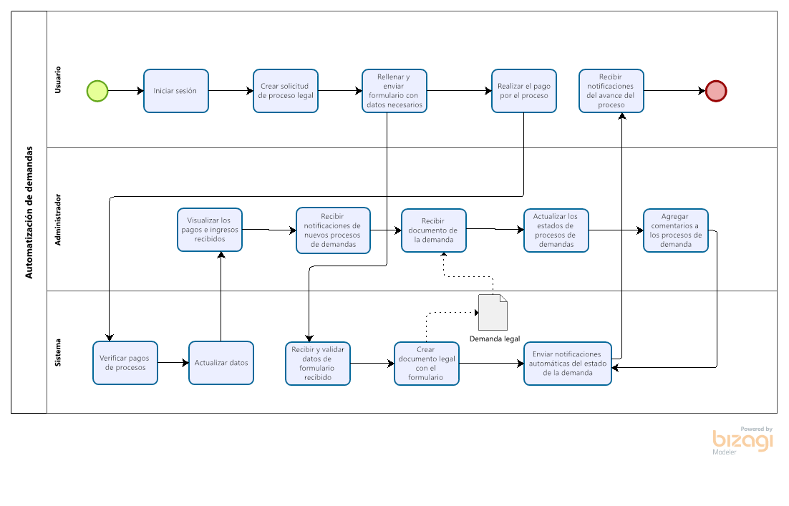
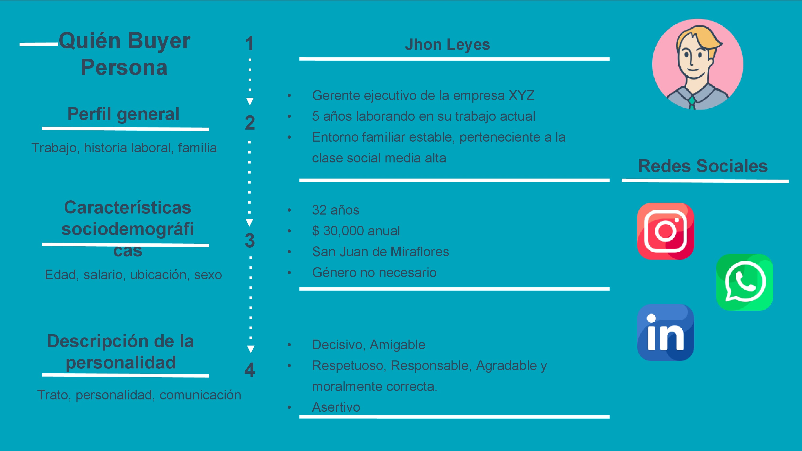

# **Analisis de requerimientos**

## 1. Datos
- Proyecto: Página web para automatizar demandas de clientes
- Cliente: Firma de abogados Abogabot
- Encargado: Bellido Ramos, Angelo

## 2. Descubrimiento de requerimientos

1.  Llenar formulario
2.  Realizar un proceso legal
3.  Validar datos de formulario recibido
4.  Pago para finalizar la transacción
5.  Crear cuenta en la plataforma
6.  Validar de datos de registro de usuario
7.  Inicio de sesión en la plataforma
8.  Dar seguimiento al proceso legal realizado
9.  Recibir notificaciones de nuevas demandas
10. Creacion automatica de documento legal
11. Visualizar los pagos recibidos e ingresos totales
12. Actualizar el proceso de demanda
13. Agregar comentarios de cada paso del proceso de demanda
14. Recibir notificaciones por correo del avance del proceso
15. Facilidad de accesibilidad con una plataforma responsive
16. Estetica de la plaforma con colores azul marino y blanco
17. Tiempo de respuesta de la plataforma óptimo
18. Cumplir estandares de seguridad para la plataforma de pago
19. El sistema debe cumplir con las leyes y reglamentos de protección de datos
    
## 3. Clasificacion y organizacion de requerimientos

### Requerimientos funcionales

#### Usuario:

* Creacion de una cuenta para ingresar a la plataforma
* Inicio sesión con su correo y contraseña
* Crear solicitud de proceso legal en la plataforma
* Rellenar un formulario con los datos necesarios
* Realizar el pago necesario del proceso legal
* Dar seguimiento al proceso legal realizado
* Recibir notificaciones por correo del avance del proceso

#### Administrador:

* Creacion de una cuenta para ingresar a la plataforma
* Inicio sesión con su correo y contraseña
* Recibir notificaciones de nuevos procesos de demandas
* Visualizar los pagos e ingresos recibidos
* Actualizar los procesos de demanda
* Agregar comentarios de cada paso a los procesos de demanda

#### Sistema:
* Validar datos de formulario recibido
* Crear automaticamente documento legal con el formulario recibido
* Validar datos de los usuarios registrados
* Enviar notificaciones automaticas del proceso de la demanda a los usuarios

### Requerimientos no funcionales

* Estetica de la plaforma con colores azul marino y blanco
* Facilidad de accesibilidad con una plataforma responsive
* Tiempo de respuesta de la plataforma óptimo
* Cumplir estandares de seguridad para la plataforma de pago
* El sistema debe cumplir con las leyes y reglamentos de protección de datos

## 4. Modelo de negocio

## 5. Buyer persona

## 6. Público objetivo
